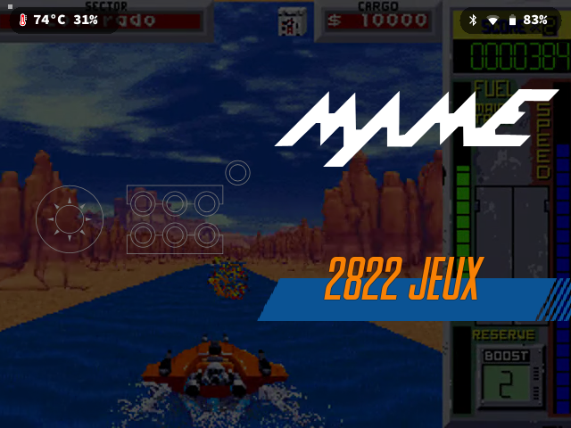
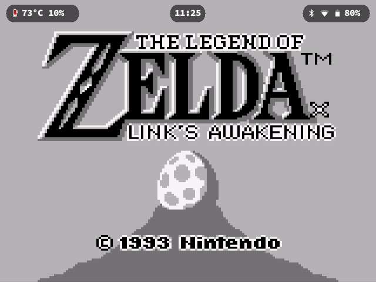
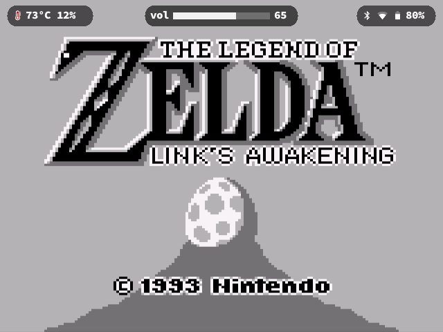
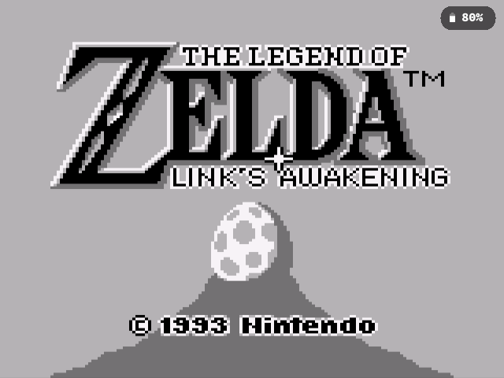
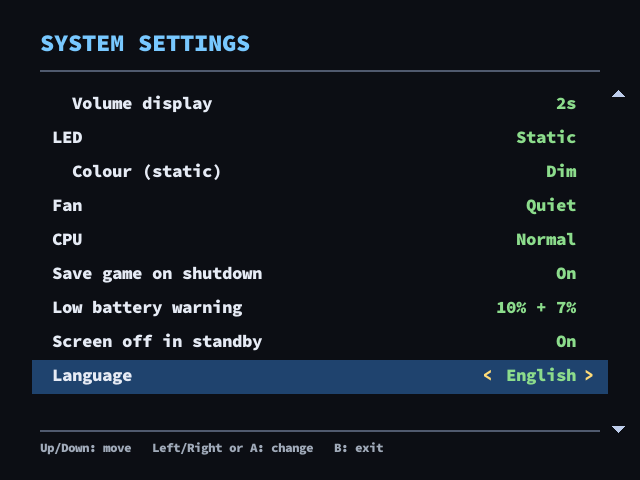
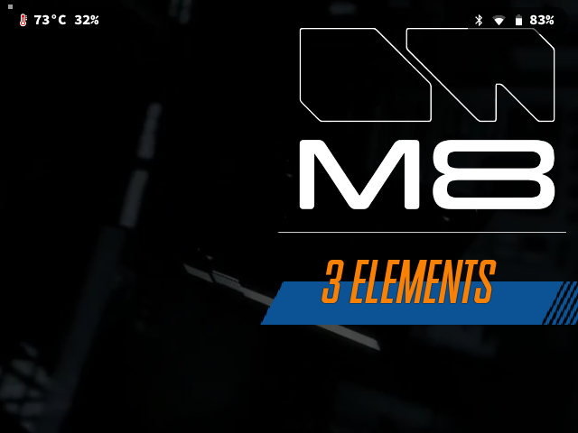
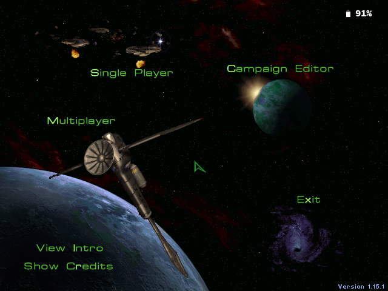
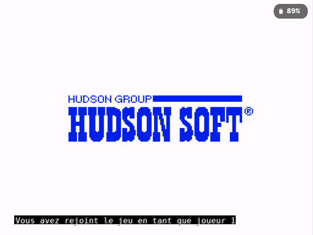
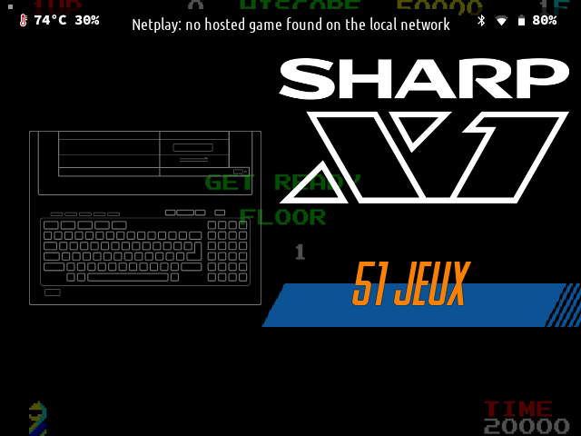
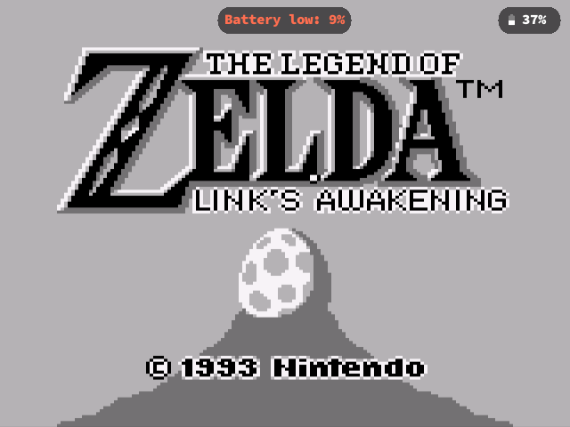

# PiBoy DMG on current Batocera

Experimental Pi, the company behind the **PiBoy DMG**, has shut down, and the
console was left stuck on old software images. This project makes the PiBoy DMG
work properly on the **latest official Batocera (43.1)**, on a **Raspberry Pi 4B
or 3B/3B+**, and adds a few mods for comfort.

Nothing is recompiled in Batocera itself: the PiBoy kernel driver
(`xpi_gamecon`) already ships in the official Pi 3/Pi 4 images. Everything here
lives in `/userdata` (plus one small boot hook), so it survives Batocera
updates.



## What you get

| | |
|---|---|
| **Battery gauge in EmulationStation** | Stock ES shows no battery on a PiBoy. The gauge is published as a standard battery, and it is a real fuel gauge: current integration plus a measured discharge curve and pack resistance model. The percentage no longer bounces up and down while draining (rms error 1.5 points vs 6.5 for a plain voltage map). |
| **In-game OSD** | A thin Wayland overlay drawn over any emulator: battery, temperature + CPU load, Wi-Fi (with a real connectivity check), Bluetooth (on / device connected), clock, a volume bar when you turn the wheel, and short system messages (low battery, game saved). Each element can be shown in menus only, in game only, everywhere, or never. It never steals your buttons. |
| **System Settings menu** | A new "System Settings" entry in ES, driven with the D-pad: OSD elements and position, LED mode/colour, fan profile, CPU governor, Wi-Fi and Bluetooth radios, system info page. English or French. |
| **Fan control** | PWM fan curve with profiles (silent, quiet, balanced, cool, custom). Full speed above 80 °C whatever the profile. |
| **Power LED** | Fixed colour of your choice, or battery mode: green > 50 %, amber 15-50 %, red < 15 %, gently pulsing while charging. |
| **Clean power handling** | Power slider and low battery trigger a clean shutdown; shutting down from the ES menu really cuts the power (otherwise the MCU keeps draining the battery while the console looks off). Reboots open the MCU's 60-second reboot window, so a slow boot (e.g. right after a Batocera update) is never powered off halfway. |
| **Game saved before shutdown** | When the power slider goes off or the battery runs out during a RetroArch game, a save state is written first (a new slot, never overwriting yours): pick it up next time from the game's save states in ES. |
| **Low battery warnings** | On-screen warning at 10 % and 7 %, then "Battery empty: saving" before the automatic shutdown at 5 %. |
| **Real screen-off standby** | The ES screensaver switches the display and backlight off through the MCU: about 450 mA saved, instant wake on any button. |
| **Volume wheel** | The wheel drives the system volume and always targets the internal speaker/jack. |
| **Stick as a mouse** | For the file manager and PC games (see StarCraft below), started only while those run, so it costs nothing otherwise. |
| **LAN netplay between two consoles** | Host from ES's own menu (long press A on a game, netplay, host). On the other console, "Netplay - Join" finds the hosted game on the network by itself and loads the same game with the same core. Clear on-screen messages when something prevents joining (game missing, core missing). |
| **Dirtywave M8** | Plug an M8 (or a Teensy running the headless firmware) over USB and use the PiBoy as its screen and controls, as its own ES system, with low-latency and safe audio presets. |
| **Windows games (Pi 4)** | Optional: box64 + Wine launchers for StarCraft 1.16.1 in a 640x480 desktop, with the stick as mouse and StarCraft shortcuts on the buttons. See [wine/README.md](wine/README.md). |
| **Wi-Fi watchdog** | Detects and repairs the "zombie" Wi-Fi link (associated but nothing goes through) and keeps Wi-Fi power-save off. |

## Screenshots

| | |
|---|---|
|  Full OSD in game: temperature + CPU, clock, Bluetooth + Wi-Fi + battery |  Volume bar when turning the wheel |
|  Default in game: battery only |  System Settings menu |
|  M8 Tracker as an ES system |  StarCraft through box64 + Wine |
|  Hosting a netplay game |  On-screen message when no game is found |
|  Low battery warning | |

## Installation

You need a PiBoy DMG with a Raspberry Pi 4B or 3B/3B+, and a fresh
[Batocera 43.1](https://batocera.org/download) image for your Pi (`bcm2711`
for the Pi 4, `bcm2837` for the Pi 3).

1. **Flash** Batocera on the SD card.
2. **Before the first boot**, open the `BATOCERA` partition on your computer
   (it is FAT, readable everywhere) and append to the end of `config.txt`:
   - [boot/config-piboy-pi4.txt](boot/config-piboy-pi4.txt) for a Pi 4,
   - [boot/config-piboy-pi3.txt](boot/config-piboy-pi3.txt) for a Pi 3 (and
     comment out its `dtoverlay=vc4-kms-v3d` line).

   Without this block the internal screen stays black.
3. **Boot** the console, connect it to Wi-Fi (Main menu, Network settings).
4. **Copy** this repository to the console's network share, for example
   `\\BATOCERA\share\piboy` from Windows (`smb://batocera/share` on macOS),
   which is `/userdata/piboy` on the console.
5. **Run** the installer over SSH (user `root`, password `linux`):

   ```sh
   sh /userdata/piboy/install.sh
   reboot
   ```

The installer is idempotent: run it again after updating the repository, your
settings are kept. Options: `--no-m8`, `--no-netplay`, `--no-wine`.

After the reboot, set a screensaver delay in ES (Main menu, UI settings,
Screensaver): when it kicks in, the screen really turns off.

## Settings files

All in `/userdata/system/`, reloaded live (a few seconds, no restart), and all
editable from the System Settings menu too:

| File | What |
|---|---|
| `piboy-osd.conf` | OSD elements, position, sizes, menu language |
| `piboy-fan.conf` | fan profile or custom curve |
| `piboy-led.conf` | LED mode and colour |
| `piboy-power.conf` | CPU governor |
| `piboy-netplay.conf` | fallback host settings for "Netplay - Host" |

Logs: `/userdata/system/piboy-dmgcontrol.log`, `piboy-osd/osd.log`,
`piboy-netplay.log`, `logs/wifi-watchdog.log`.

## Notes and limits

- **Battery**: the gauge is calibrated on a stock pack, which measures about
  4000 mAh usable (not the 4900 on the label), and the charger tops out
  around 4.12 V. If you fitted a different cell, adjust `BATT_CAPACITY_MAH` at
  the top of `piboy-dmgcontrol.py`.
- **Netplay** needs the exact same ROM file at the same path on both consoles,
  and both must run the same core. A Pi 3 cannot keep up with every core a Pi 4
  runs; `piboy-netplay-cores.conf` lists the ones to avoid (a warning, not a
  block).
- **Pi 3**: fine for 8/16-bit systems and light arcade. Standby uses a slightly
  different script (signal off before power) because some panels do not wake
  up otherwise.
- **MCU firmware**: the installer shows the PiBoy's firmware version. 1.0.6 is the
  last release for the DMG and fixes reboot/shutdown issues; if yours is older,
  Experimental Pi's updater is preserved at https://archive.org/details/EXPPI.
- **RetroArch network commands** are enabled (`global.retroarch.network_cmd_enable`,
  UDP port 55355) for the save-before-shutdown feature. They are reachable from
  your local network; set the key back to `false` in `batocera.conf` if you prefer.
- **Tested** on Batocera 43.1 with a Pi 4B 8 GB and a Pi 3B. Some code comments
  are still in French; user-facing text is in English.

## Building the OSD

Prebuilt aarch64 binaries are included. To rebuild them, from `src/osd/`:

```sh
python3 build-cross.py                 # needs clang + lld, downloads a Debian arm64 sysroot
# or, with Docker: see compile.sh and Dockerfile
```

## Credits and licences

This project is released under the [MIT licence](LICENSE). It bundles or
depends on third-party work listed in [NOTICE.md](NOTICE.md), notably
[m8c](https://github.com/laamaa/m8c) by Jonne Kokkonen (MIT), the
`xpi_gamecon` driver shipped with Batocera, Google's Material icons
(Apache 2.0), Source Code Pro (SIL OFL) and the stb headers (public domain).
